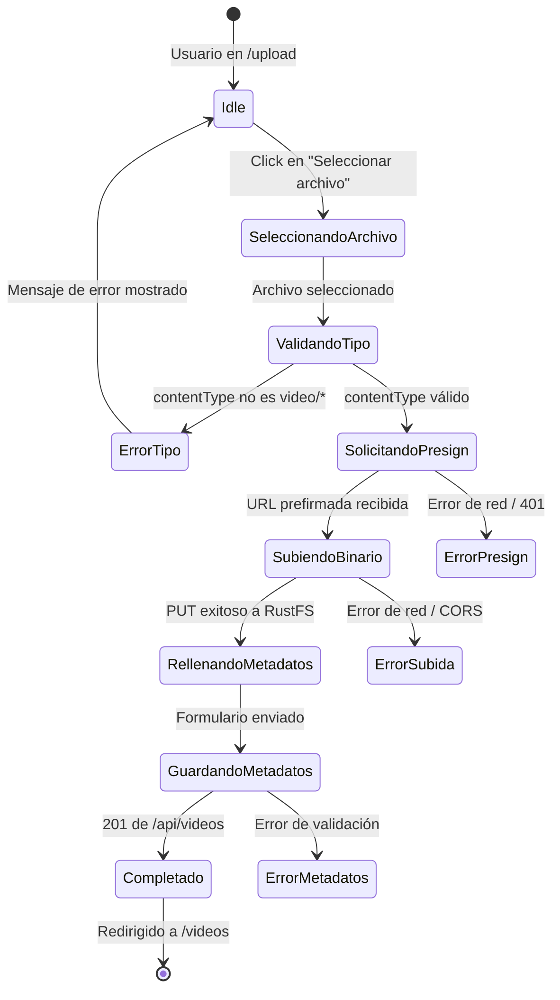

# VideoVault — Plataforma de Subida y Gestión de Videos

[](https://github.com/Jorgeaapaz/MISEIA_1-4-90-upload-videos/actions/workflows/ci-cd.yml)


Aplicación web **full-stack en Next.js 16 / TypeScript 5** que permite a usuarios autenticados **subir, gestionar, buscar y reproducir videos** almacenados en un object store compatible con S3 (RustFS), con metadatos persistidos en MongoDB.

---

## 1. Funcionalidades Implementadas

### 1.1 Autenticación (Registro / Inicio de sesión / JWT)

Los usuarios se registran con correo electrónico y contraseña (hash bcrypt con 10 rondas de sal). Al iniciar sesión reciben un JWT firmado (HS256, caducidad 7 días) que se guarda en `localStorage` y en una cookie `HttpOnly`. Cada ruta API protegida valida el token en el servidor. Cada usuario solo puede ver y gestionar sus propios videos.

**Detalles técnicos:**
- Biblioteca: `jsonwebtoken` + `bcryptjs`
- Secreto: variable de entorno `JWT_SECRET` (mínimo 32 caracteres)
- Extracción de token: cabecera `Authorization: Bearer` o cookie `token`

### 1.2 Subida de Videos (Cliente directo a RustFS con URL prefirmada)

El flujo de subida utiliza **URL prefirmadas**: el navegador solicita una URL firmada temporalmente al API, luego sube el archivo binario directamente a RustFS, manteniendo al servidor Next.js fuera del camino de datos. El bucket `videos` se crea automáticamente si no existe. Se configura la política CORS del bucket en el arranque para permitir peticiones `PUT` cross-origin desde el navegador.

**Detalles técnicos:**
- SDK: `@aws-sdk/client-s3` + `@aws-sdk/s3-request-presigner`
- URL prefirmada con expiración de 1 hora
- Cliente interno para operaciones de servidor; cliente público (`RUSTFS_PUBLIC_ENDPOINT`) para generar URLs accesibles por el navegador vía HTTPS
- Configuración CORS automática mediante `PutBucketCorsCommand` al inicializar el bucket

### 1.3 Gestión de Metadatos

Tras la subida, el usuario rellena un formulario con: nombre del video, descripción, etiquetas (multi-valor) y pares clave-valor arbitrarios. Los metadatos se persisten en MongoDB y son completamente buscables.

### 1.4 Búsqueda

Búsqueda de texto completo sobre nombre, descripción, etiquetas y metadatos clave-valor personalizados. Implementada con consultas de expresión regular en MongoDB sobre el servidor, con paginación (12 videos por página).

### 1.5 Streaming de Video

Los videos se transmiten mediante la ruta `/api/stream/[id]` que actúa como proxy de peticiones de rango de bytes desde RustFS hacia el reproductor HTML5 `<video>`, habilitando navegación (`seek`) y contenido parcial (HTTP 206).

**Solución al bug de RustFS en el límite de 8 MB:** RustFS devuelve 206 con 0 bytes para cualquier petición de rango que comience en el límite de 8 MB. La ruta de stream almacena el objeto completo en memoria (para archivos ≤ 50 MB) y sirve los bytes directamente.

### 1.6 Dashboard

Muestra estadísticas por usuario: total de videos subidos, espacio total consumido y cuadrícula de subidas recientes.

---

## 2. Estructura del Proyecto

```
upload-videos/
├── app/
│   ├── (auth)/
│   │   ├── login/page.tsx              — Formulario de inicio de sesión
│   │   └── register/page.tsx           — Formulario de registro
│   ├── (main)/
│   │   ├── layout.tsx                  — Layout protegido con Navbar
│   │   ├── dashboard/page.tsx          — Dashboard con estadísticas
│   │   ├── upload/page.tsx             — Página de subida + formulario de metadatos
│   │   ├── videos/page.tsx             — Biblioteca de videos con búsqueda y paginación
│   │   └── videos/[id]/page.tsx        — Detalle del video y reproductor HTML5
│   ├── api/
│   │   ├── auth/login/route.ts         — POST /api/auth/login
│   │   ├── auth/register/route.ts      — POST /api/auth/register
│   │   ├── auth/me/route.ts            — GET /api/auth/me (validación de token)
│   │   ├── dashboard/stats/route.ts    — GET /api/dashboard/stats
│   │   ├── stream/[id]/route.ts        — GET /api/stream/[id] (proxy de rango de bytes)
│   │   ├── upload/presign/route.ts     — POST /api/upload/presign (URL prefirmada)
│   │   ├── videos/route.ts             — GET (listar) / POST (crear) videos
│   │   └── videos/[id]/route.ts        — GET / DELETE video individual
│   ├── layout.tsx                      — Layout raíz, AuthProvider
│   ├── page.tsx                        — Landing page
│   └── globals.css                     — Estilos globales Tailwind CSS
├── components/
│   ├── MetadataForm.tsx                — Editor de metadatos clave-valor
│   ├── Navbar.tsx                      — Barra de navegación superior
│   ├── SearchBar.tsx                   — Componente de búsqueda
│   ├── StatsCard.tsx                   — Tarjeta de estadística del dashboard
│   ├── TagInput.tsx                    — Input de etiquetas con añadir/eliminar
│   ├── UploadForm.tsx                  — Selector de archivo + presign + subida
│   ├── VideoCard.tsx                   — Tarjeta miniatura de video
│   └── VideoPlayer.tsx                 — Wrapper del reproductor HTML5
├── context/
│   └── AuthContext.tsx                 — Contexto React para estado JWT
├── lib/
│   ├── auth.ts                         — Utilidades JWT sign/verify + bcrypt
│   ├── mongodb.ts                      — Singleton del cliente MongoDB
│   ├── s3.ts                           — Cliente S3 (RustFS) + inicialización bucket + CORS
│   └── types.ts                        — Tipos TypeScript compartidos
├── __tests__/
│   ├── __mocks__/mongodb.ts            — Mock del cliente MongoDB para tests
│   ├── api/auth.test.ts                — Tests de rutas /api/auth/*
│   ├── api/video-detail.test.ts        — Tests de GET/DELETE /api/videos/[id]
│   ├── api/videos.test.ts              — Tests de GET/POST /api/videos
│   └── lib/auth.test.ts               — Tests unitarios de lib/auth
├── docs/
│   ├── adr/                            — Architecture Decision Records (ADR-001 a ADR-005)
│   ├── compliance/                     — Informes de cumplimiento PERT
│   ├── AI_USAGE.md                     — Registro de uso de IA por módulo
│   ├── BENCHMARKS.md                   — Benchmarks cuantitativos de decisiones clave
│   └── DECISIONS.md                    — Justificaciones de decisiones técnicas
├── scripts/
│   └── benchmark-auth.js              — Benchmark JWT vs sesión MongoDB
├── .github/workflows/ci-cd.yml        — Pipeline CI/CD GitHub Actions
├── .gitlab-ci.yml                      — Pipeline CI/CD GitLab
├── Dockerfile                          — Imagen Docker multi-etapa de producción
├── docker-compose.prod.yml             — Compose de producción (app + Traefik)
├── deploy.sh                           — Script de despliegue SSH a GCP VM
├── jest.config.js                      — Configuración Jest (CommonJS)
├── jest.setup.ts                       — Setup global de Jest
├── tsconfig.test.json                  — Configuración TypeScript para tests
├── package.json                        — Dependencias y scripts npm
├── package-lock.json                   — Lockfile npm para instalaciones reproducibles
└── next.config.ts                      — Configuración de Next.js
```

---

## 3. Patrones de Diseño y Arquitectura

| Patrón | Implementación |
|---|---|
| **Repository / Service layer** | `lib/mongodb.ts` y `lib/s3.ts` encapsulan toda la lógica de acceso a datos, manteniendo las rutas API delgadas |
| **Presigned URL (subida delegada)** | `app/api/upload/presign/route.ts` — el servidor firma la URL, el navegador escribe directamente en el object store |
| **Singleton** | `lib/mongodb.ts` mantiene una única instancia del cliente MongoDB por proceso para evitar el agotamiento del pool de conexiones |
| **Context + Provider (React)** | `context/AuthContext.tsx` distribuye el estado de autenticación y el helper de logout a todo el árbol de componentes |
| **Route Groups** | Los grupos de rutas Next.js `(auth)` y `(main)` aplican layouts diferentes sin afectar las rutas URL |
| **Proxy de rango de bytes** | `app/api/stream/[id]/route.ts` reenvía respuestas HTTP 206 de contenido parcial, habilitando seek nativo en HTML5 |
| **Dual-client S3** | Dos instancias del cliente S3: una interna para operaciones de servidor, una pública para generar URLs prefirmadas accesibles desde el navegador |

### 3.1 Dependencias Bloqueadas (Lockfile)

El proyecto incluye un **`package-lock.json`** comprometido en el repositorio, lo que garantiza instalaciones reproducibles en todos los entornos (desarrollo, CI/CD, producción). Este archivo bloquea versiones exactas de todas las dependencias transitivas.

```
package-lock.json   — Lockfile de npm (Node Package Manager)
                      Generado automáticamente con `npm install`
                      Debe ser comprometido al repositorio para reproducibilidad
                      Utilizado por `npm ci` en CI/CD para instalaciones deterministas
```

Para instalar exactamente las versiones especificadas en el lockfile:
```bash
npm ci   # instalación determinista usando package-lock.json
```

---

## 4. Cómo Funciona

1. **Flujo de subida** — el cliente llama a `/api/upload/presign` para obtener una URL firmada temporal, sube el binario directamente a RustFS (evitando el servidor Next.js), luego hace POST de los metadatos (nombre, descripción, etiquetas, claves-valores) a `/api/videos`.
2. **Flujo de reproducción** — el elemento `<video>` apunta a `/api/stream/[id]`, que obtiene el objeto de RustFS con soporte de rango y lo transmite de vuelta al navegador con HTTP 206.
3. **Flujo de búsqueda** — la página de lista de videos envía una cadena de consulta a `GET /api/videos?q=...`, que ejecuta una búsqueda regex/etiqueta en MongoDB y devuelve resultados filtrados y paginados.

```typescript
// Subida prefirmada — lado cliente
const { uploadUrl, key } = await fetch('/api/upload/presign', {
  method: 'POST',
  headers: { 'Content-Type': 'application/json', Authorization: `Bearer ${token}` },
  body: JSON.stringify({ fileName: file.name, contentType: file.type }),
}).then(r => r.json());

// PUT directo al object store (sin pasar por el servidor)
await fetch(uploadUrl, { method: 'PUT', body: file, headers: { 'Content-Type': file.type } });

// Guardar metadatos
await fetch('/api/videos', {
  method: 'POST',
  headers: { 'Content-Type': 'application/json', Authorization: `Bearer ${token}` },
  body: JSON.stringify({ key, name, description, tags, metadata }),
});
```

---

## 5. Cómo Empezar

### Prerequisitos

- **Node.js** 20+
- **MongoDB** corriendo localmente en el puerto `27017`
- **RustFS** (o cualquier almacén compatible con S3) en `http://localhost:10000` con credenciales `minioadmin / minioadmin1234`

### Clonar

```bash
git clone https://github.com/Jorgeaapaz/MISEIA_1-4-90-upload-videos.git
cd MISEIA_1-4-90-upload-videos
```

### Variables de Entorno

Copiar `.env.example` a `.env.local` y completar los valores:

```bash
cp .env.example .env.local
```

```env
MONGODB_URI=mongodb://localhost:27017
MONGODB_DB=videovault
RUSTFS_ENDPOINT=http://localhost:10000
RUSTFS_ACCESS_KEY=minioadmin
RUSTFS_SECRET_KEY=minioadmin1234
RUSTFS_BUCKET=videos
# En producción, URL HTTPS pública para URLs prefirmadas:
# RUSTFS_PUBLIC_ENDPOINT=https://rustfs-api.tudominio.com
JWT_SECRET=<generar con: node -e "console.log(require('crypto').randomBytes(32).toString('hex'))">
```

### Instalar y Ejecutar

```bash
npm ci          # instala usando package-lock.json (reproducible)
npm run dev     # servidor de desarrollo en http://localhost:3000
```

### Ejecutar Tests

```bash
npm test                 # ejecutar todos los tests
npm run test:coverage    # tests con reporte de cobertura
```

### Compilar para Producción

```bash
npm run build
npm start
```

---

## 6. Ejemplos de Uso

### Éxito — Registro y Subida

```
POST /api/auth/register   { email: "alice@example.com", password: "secret123" }
→ 201 { success: true, message: "Usuario registrado correctamente" }

POST /api/auth/login      { email: "alice@example.com", password: "secret123" }
→ 200 { token: "eyJhbGci..." }

POST /api/upload/presign  Authorization: Bearer <token>
                          { fileName: "demo.mp4", contentType: "video/mp4" }
→ 200 { uploadUrl: "https://rustfs-api.deviaaps.com/videos/...", key: "uuid/demo.mp4" }

PUT  <uploadUrl>          (cuerpo binario del video)
→ 200 OK  (escritura directa en RustFS)

POST /api/videos          { key, name: "Demo", description: "...", tags: ["tutorial"] }
→ 201 { _id: "...", name: "Demo", ... }
```

### Caso Borde — Búsqueda sin Resultados

```
GET /api/videos?q=termino_inexistente
→ 200 { videos: [], total: 0, totalPages: 0 }
```

### Caso Borde — Acceso No Autorizado

```
GET /api/videos           (sin cabecera Authorization)
→ 401 { error: "No autorizado" }
```

### Caso Borde — Tipo de Archivo No Permitido

```
POST /api/upload/presign  { fileName: "imagen.jpg", contentType: "image/jpeg" }
→ 400 { error: "Solo se permiten archivos de video" }
```

---

## 7. Requisitos

### 7.1 Requisitos Funcionales (IEEE 830)

```
FR-001: El usuario no autenticado deberá poder registrarse con correo y contraseña
        so that se crea una cuenta única y el usuario puede acceder al sistema.

FR-002: El usuario registrado deberá poder iniciar sesión con sus credenciales
        so that recibe un JWT válido y accede a las funciones protegidas.

FR-003: El usuario autenticado deberá poder subir un archivo de video desde el navegador
        so that el video queda almacenado en RustFS y disponible para reproducción.

FR-004: El usuario autenticado deberá poder añadir nombre, descripción, etiquetas y
        metadatos clave-valor a cada video
        so that el contenido es categorizado y recuperable mediante búsqueda.

FR-005: El usuario autenticado deberá poder buscar videos por nombre, descripción,
        etiquetas o metadatos personalizados
        so that localiza contenido específico sin revisar toda la biblioteca.

FR-006: El usuario autenticado deberá poder reproducir sus videos directamente en el
        navegador mediante el reproductor HTML5
        so that puede ver el contenido sin descargar el archivo.

FR-007: El usuario autenticado deberá poder navegar hacia cualquier punto del video
        durante la reproducción (seek)
        so that no está obligado a ver el video desde el principio.

FR-008: El usuario autenticado deberá poder eliminar sus propios videos
        so that el objeto se borra de RustFS y los metadatos de MongoDB.

FR-009: El usuario autenticado deberá poder consultar un dashboard con estadísticas
        de sus videos (total de videos y espacio ocupado)
        so that tiene visibilidad del uso de su almacenamiento.

FR-010: El sistema deberá crear automáticamente el bucket de almacenamiento si no existe
        so that el despliegue funciona sin configuración manual de infraestructura.

FR-011: El sistema deberá paginar los resultados de búsqueda con un máximo de 12 videos
        por página so that la interfaz permanece ágil con bibliotecas grandes.

FR-012: El usuario autenticado solamente deberá poder ver y gestionar sus propios videos
        so that se garantiza el aislamiento de datos entre usuarios.
```

### 7.2 Requisitos No Funcionales (Cuantificados)

```
NFR-PERF-001: Latencia de API < 200ms en el percentil 95 para operaciones de lista/búsqueda
              → Consultas indexadas en MongoDB + singleton de conexión

NFR-PERF-002: Generación de URL prefirmada < 50ms
              → Operación local de firma criptográfica sin red

NFR-SEC-001:  Contraseñas almacenadas con bcrypt, cost factor 10 (≥ 100ms por hash)
              → Resistencia a ataques de fuerza bruta offline

NFR-SEC-002:  JWT con expiración de 7 días; secreto de mínimo 256 bits de entropía
              → Ningún token válido permanece activo más de 7 días

NFR-SEC-003:  Variables de entorno nunca comprometidas en el repositorio; .env* en .gitignore
              → Secretos gestionados exclusivamente mediante CI/CD secrets

NFR-SCAL-001: Arquitectura sin estado (stateless) que permite escalar horizontalmente
              la capa Next.js sin compartir estado de sesión entre instancias
              → JWT valida localmente sin consulta a base de datos

NFR-SCAL-002: Subida directa cliente→RustFS que elimina al servidor Next.js del
              camino de datos de los archivos, permitiendo subidas concurrentes ilimitadas

NFR-USAB-001: El flujo completo de subida (selección → metadatos → confirmación) debe
              completarse en ≤ 4 pasos de interacción del usuario

NFR-AVAIL-001: El servicio debe estar disponible ≥ 99.5% del tiempo mensual
               → Despliegue con `restart: unless-stopped` en Docker

NFR-MAINT-001: Cobertura de tests ≥ 60% en líneas de código de dominio (lib/ + api/)
               → Medida con `npm run test:coverage`; umbral configurado en jest.config.js

NFR-OBS-001:  Todos los errores de API deben registrarse con código de estado HTTP,
              ruta y timestamp; sin exponer trazas de stack en respuestas al cliente
```

### 7.3 Requisitos Regulatorios (Aplicables en México)

```
REG-001 (LFPDPPP — Ley Federal de Protección de Datos Personales en Posesión de
         los Particulares): Los datos personales de los usuarios (correo electrónico,
         contraseña hasheada) deben almacenarse con medidas de seguridad técnicas
         adecuadas y no cederse a terceros sin consentimiento. El sistema cumple
         almacenando únicamente hash de contraseña y no compartiendo datos con
         servicios externos.

REG-002 (NOM-151-SCFI-2016 — Conservación de mensajes de datos): Los registros de
         transacciones digitales (creación de cuenta, subida de video) deben
         conservarse de forma íntegra y verificable. El sistema registra timestamps
         en cada documento de MongoDB con campo `uploadedAt`.

REG-003 (Ley Federal del Derecho de Autor): El sistema no verifica los derechos de
         autor del contenido subido. El operador debe establecer en los Términos de
         Servicio que el usuario es responsable de los derechos del contenido que sube,
         en cumplimiento de los artículos 27 y 28 de la LFDA.
```

### 7.4 Requisitos Operativos

```
OPS-001: El despliegue en producción se realiza mediante pipeline CI/CD (GitHub Actions /
         GitLab CI) con construcción de imagen Docker, sincronización de archivos por SSH
         y reconstrucción automática del contenedor; rollback manual si la tasa de error
         supera el 5% en los primeros 5 minutos.

OPS-002: RPO < 1 hora. Los datos de MongoDB deben respaldarse diariamente con retención
         de 30 días mediante mongodump o snapshot de volumen Docker. Verificación:
         simulacro trimestral de restauración.

OPS-003: RTO < 4 horas. El procedimiento de recuperación ante desastres consiste en:
         (1) aprovisionar VM GCP desde snapshot, (2) restaurar volumes Docker,
         (3) ejecutar deploy.sh para levantar la aplicación.

OPS-004: El sistema debe monitorearse con verificación de salud en `/api/auth/me`
         cada 60 segundos; alerta en menos de 2 minutos si el endpoint devuelve
         un código distinto de 401/200. Herramienta: Uptime Kuma o similar.

OPS-005: Los certificados TLS administrados por Traefik + Let's Encrypt se renuevan
         automáticamente 30 días antes del vencimiento vía desafío DNS-01 (Cloudflare).
         Verificación: revisión mensual del estado del certificado.
```

### 7.5 Atributos de Calidad

#### 7.5.1 Rendimiento: Latencia de Streaming [PERF-STREAM-LATENCY]
**Atributo de Calidad:** Rendimiento
**Métrica:** Tiempo hasta primer byte (TTFB) en ms

**Especificación:**
- Percentil 99: < 500ms para iniciar la transmisión
- Percentil 95: < 200ms
- Percentil 50: < 80ms

**Condiciones:**
- Videos ≤ 500 MB alojados en RustFS en la misma red Docker
- Conexión de red de al menos 10 Mbps entre cliente y servidor
- Un máximo de 10 reproducciones concurrentes

**Excepciones:**
- Primera reproducción tras arranque en frío del contenedor: hasta 2 segundos aceptable
- Videos > 50 MB: sin caché en memoria; se acepta latencia adicional de 100ms

**Verificación:**
- Test de carga con k6; medición en logs de Traefik con tiempo de respuesta

#### 7.5.2 Escalabilidad: Subidas Concurrentes [SCAL-UPLOAD-CONCURRENCY]
**Atributo de Calidad:** Escalabilidad
**Métrica:** Número de subidas concurrentes sin degradación

**Especificación:**
- El servidor Next.js debe soportar ≥ 50 solicitudes de presign simultáneas sin aumento de latencia > 20%
- RustFS maneja las subidas directas; el servidor no está en el camino de datos de binarios
- Escalado horizontal de Next.js sin cambios de código (stateless JWT)

**Condiciones:**
- Instancia única de Next.js con 2 vCPU / 4 GB RAM
- Archivos de video de hasta 2 GB

**Excepciones:**
- Subidas de archivos > 2 GB pueden requerir ajuste del límite de tiempo de la URL prefirmada

**Verificación:** Test de carga con k6 simulando 50 usuarios concurrentes solicitando presign

#### 7.5.3 Confiabilidad: Reintentos de Conexión MongoDB [RELI-MONGO-RECONNECT]
**Atributo de Calidad:** Confiabilidad
**Métrica:** Tiempo de recuperación tras pérdida de conexión MongoDB (segundos)

**Especificación:**
- El singleton de cliente MongoDB debe reconectarse automáticamente en < 30 segundos
- Tasa de error en operaciones CRUD: < 0.1% en condiciones normales

**Condiciones:**
- Pérdida temporal de conectividad de red < 60 segundos
- MongoDB con `serverSelectionTimeoutMS: 5000`

**Excepciones:**
- Pérdidas de red > 5 minutos pueden requerir reinicio manual del contenedor

**Verificación:** Test de caos: desconectar temporalmente MongoDB y verificar recuperación automática

#### 7.5.4 Seguridad: Protección de Credenciales [SEC-CREDENTIAL-PROTECTION]
**Atributo de Calidad:** Seguridad
**Métrica:** 0 credenciales expuestas en repositorio o respuestas de API

**Especificación:**
- 0 secretos (JWT_SECRET, contraseñas de base de datos, claves S3) comprometidos en git
- 0 trazas de pila o mensajes de error internos expuestos en respuestas HTTP
- 100% de contraseñas de usuario almacenadas como hash bcrypt (cost 10)

**Condiciones:**
- Escaneo del historial de git con `git-secrets` o `truffleHog`
- Revisión de respuestas de API en modo producción

**Excepciones:**
- `.env.example` puede contener valores de ejemplo no reales

**Verificación:** Escaneo automatizado de secretos en pipeline CI/CD; revisión manual de respuestas 5xx

#### 7.5.5 Mantenibilidad: Cobertura de Tests [MAINT-TEST-COVERAGE]
**Atributo de Calidad:** Mantenibilidad
**Métrica:** Porcentaje de líneas cubiertas por tests automatizados

**Especificación:**
- Cobertura global: ≥ 60% de líneas en código de dominio (`lib/`, `app/api/`)
- Cobertura de funciones: ≥ 60%
- Cobertura de ramas: ≥ 50%

**Condiciones:**
- Medida con Jest + cobertura V8
- Umbral configurado en `jest.config.js` bajo `coverageThreshold`

**Excepciones:**
- Código de UI (`app/(main)/`, `components/`) excluido de los umbrales de cobertura obligatorios

**Verificación:** `npm run test:coverage`; el pipeline CI/CD falla si no se alcanzan los umbrales

### 7.6 Criterios de Aceptación BDD

```gherkin
Feature: Registro de usuario
  Scenario: Registro exitoso con credenciales válidas
    Given el usuario está en la página de registro
    And el usuario introduce el correo "nuevo@ejemplo.com" y la contraseña "segura123"
    When el usuario envía el formulario de registro
    Then el sistema crea la cuenta y devuelve 201
    And el usuario es redirigido a la página de inicio de sesión

Feature: Subida de video
  Scenario: Subida exitosa de un archivo de video
    Given el usuario está autenticado con un JWT válido
    And selecciona un archivo MP4 de 50 MB
    When el sistema genera una URL prefirmada y el navegador sube el archivo directamente a RustFS
    Then el archivo queda almacenado en RustFS
    And el usuario puede rellenar el formulario de metadatos

Feature: Búsqueda de videos
  Scenario: Búsqueda que devuelve resultados relevantes
    Given el usuario tiene 3 videos con etiqueta "tutorial"
    When el usuario busca "tutorial" en la barra de búsqueda
    Then el sistema devuelve exactamente los 3 videos con esa etiqueta
    And los resultados se muestran paginados

Feature: Reproducción de video con seek
  Scenario: El usuario navega hacia el minuto 2 de un video
    Given el usuario está en la página de detalle del video
    And el video tiene una duración de 5 minutos
    When el usuario arrastra la barra de progreso hasta el minuto 2
    Then el reproductor HTML5 envía una petición de rango HTTP 206
    And la reproducción continúa desde el punto seleccionado sin interrupciones

Feature: Control de acceso
  Scenario: Usuario intenta acceder a videos de otro usuario
    Given el usuario A y el usuario B están registrados
    And el usuario B tiene 3 videos
    When el usuario A hace GET /api/videos con su propio JWT
    Then solo ve sus propios videos
    And ningún video del usuario B aparece en la respuesta
```

---

## 8. Especificaciones

### 8.1 Desarrollo Orientado por Especificaciones

#### Especificación Funcional: Sistema de Subida de Video

**Caso de Uso: Subir Video con Metadatos**
**Actores:** Usuario autenticado, RustFS, MongoDB

**Precondiciones:**
- El usuario está autenticado (JWT válido)
- El bucket `videos` existe o puede crearse
- El archivo es de tipo `video/*`

**Flujo Principal:**
1. El usuario selecciona un archivo de video en la UI
2. El cliente solicita una URL prefirmada a `POST /api/upload/presign`
3. El servidor valida el JWT y el tipo de contenido, genera la URL con `PutObjectCommand`
4. El cliente realiza `PUT` del binario directamente a RustFS
5. El cliente envía metadatos a `POST /api/videos`
6. El servidor persiste el documento en MongoDB y devuelve 201 con el video creado

**Criterios de Aceptación:**
- Dado usuario autenticado con archivo MP4 de 100 MB
- Cuando solicita presign y sube el archivo
- Entonces RustFS almacena el objeto y MongoDB registra los metadatos
- Y el video aparece en la biblioteca del usuario

#### Especificación Estructural

```
Capa de presentación (Next.js App Router):
  ├── Route Groups: (auth) y (main) con layouts independientes
  ├── Componentes React reutilizables en /components/
  └── Contexto de autenticación global en /context/AuthContext.tsx

Capa de API (Next.js API Routes):
  ├── /api/auth/*     → Autenticación (registro, login, validación)
  ├── /api/videos/*   → CRUD de metadatos de video
  ├── /api/upload/*   → Generación de URL prefirmada
  ├── /api/stream/*   → Proxy de streaming con rango de bytes
  └── /api/dashboard/ → Estadísticas agregadas por usuario

Capa de infraestructura (lib/):
  ├── mongodb.ts  → Singleton MongoClient, getDb(), ensureIndexes()
  ├── s3.ts       → Clientes S3 (interno + público), CORS, presign, stream
  ├── auth.ts     → JWT sign/verify, bcrypt hash/compare, extractToken
  └── types.ts    → Interfaces TypeScript compartidas (JWTPayload, Video, etc.)

Almacenamiento:
  ├── MongoDB  → Colección `users` (email, passwordHash, createdAt)
  │              Colección `videos` (userId, name, tags, metadata, s3Key, size...)
  └── RustFS   → Objetos binarios en bucket `videos` organizados por userId/uuid-filename
```

#### Especificación Conductual (Máquina de Estados — Flujo de Subida)



#### Especificación Operativa: VideoVault en Producción

**Despliegue**
- Imagen Docker multi-etapa (build en Node.js Alpine, runtime mínimo)
- Sincronización de código a VM GCP vía rsync+SSH en pipeline CI/CD
- `docker compose -f docker-compose.prod.yml up -d --build` en la VM
- Rollback manual si tasa de error > 5% en primeros 5 minutos

**Escalado**
- Capa Next.js: stateless (JWT); escalado horizontal añadiendo réplicas
- RustFS: escalado vertical (almacenamiento en volumen Docker persistente)
- MongoDB: instancia única local; migrar a replica set si > 1000 usuarios concurrentes

**Monitoreo**
- Health check: `GET /api/auth/me` → esperado 401 (indica que el servidor responde)
- Latencia p95 < 200ms en rutas de API
- Tasa de error < 1%

**Runbook: Contenedor caído**
1. `docker compose -f docker-compose.prod.yml ps` — verificar estado
2. `docker compose -f docker-compose.prod.yml logs videovault --tail=50` — revisar logs
3. Si error de configuración: corregir `.env.prod` y `up -d --build`
4. Si error de red: verificar conectividad a MongoDB y RustFS con `docker network inspect miseia-net`
5. Si persiste: ejecutar `deploy.sh` desde la máquina local para re-desplegar

### 8.2 Invariantes y Contratos

#### Contrato: autenticateRequest

```
PRECONDICIÓN:
- request: Request (objeto HTTP válido de la Web API)
- JWT_SECRET está definido en el entorno de ejecución

POSTCONDICIÓN:
- Si el token es válido: devuelve JWTPayload { userId, email, name }
- Si no hay token o es inválido: devuelve null
- Nunca lanza una excepción (los errores de verifyToken son capturados)

INVARIANTE:
- El JWT_SECRET no se modifica durante la ejecución
- El payload devuelto siempre contiene userId como string no vacío

EJEMPLOS:
- authenticateRequest(req con Bearer válido) → { userId: "abc123", email: "u@e.com", name: "U" }
- authenticateRequest(req sin Authorization) → null
- authenticateRequest(req con token expirado) → null
```

#### Contrato: getPresignedUploadUrl

```
PRECONDICIÓN:
- key: string no vacío (formato: "userId/uuid-filename.ext")
- contentType: string que comienza con "video/"
- El bucket existe (ensureBucket() fue llamado previamente)
- RUSTFS_PUBLIC_ENDPOINT o RUSTFS_ENDPOINT está definido

POSTCONDICIÓN:
- Devuelve una URL HTTPS válida con firma AWS4-HMAC-SHA256
- La URL es válida por 3600 segundos desde su generación
- La URL apunta al endpoint público (accesible desde el navegador)

INVARIANTE:
- La clave del objeto en RustFS corresponde exactamente a `key`
- El ContentType del objeto almacenado será el `contentType` especificado

EJEMPLOS:
- getPresignedUploadUrl("abc/uuid-video.mp4", "video/mp4")
  → "https://rustfs-api.deviaaps.com/videos/abc/uuid-video.mp4?X-Amz-..."
- getPresignedUploadUrl("", "video/mp4") → Error (precondición violada)
```

#### Contrato: ensureBucket

```
PRECONDICIÓN:
- RUSTFS_BUCKET está definido en el entorno
- El cliente s3Client está correctamente inicializado con credenciales válidas

POSTCONDICIÓN:
- El bucket especificado en RUSTFS_BUCKET existe en RustFS
- La política CORS del bucket permite PUT/GET desde cualquier origen (AllowedOrigins: ['*'])
- bucketReady = true (las llamadas subsiguientes son no-op)

INVARIANTE:
- La función es idempotente: múltiples llamadas producen el mismo resultado
- El bucket no se elimina ni se modifica (solo se crea y configura si es necesario)

EJEMPLOS:
- ensureBucket() cuando el bucket no existe → crea bucket + configura CORS
- ensureBucket() cuando el bucket ya existe → configura CORS solamente
- ensureBucket() llamada dos veces → segunda llamada retorna inmediatamente (bucketReady=true)
```

### 8.3 ADRs (Architecture Decision Records)

#### ADR-001: URL Prefirmadas vs. Subida a través del Servidor

**Estado:** Aceptado

**Contexto**
El equipo evaluó cómo manejar la subida de archivos de video (hasta 2 GB). La alternativa obvia es recibir el archivo en el servidor Next.js y retransmitirlo a RustFS. Esto simplifica el CORS pero genera un cuello de botella severo.

**Opciones consideradas**
1. **Subida a través del servidor**: simple pero limita la concurrencia al ancho de banda del servidor
2. **URL prefirmada (presigned URL)**: el servidor firma la URL, el cliente sube directamente al object store
3. **Upload multipart del lado del servidor**: complejo, mismo problema de cuello de botella

**Decisión**
URL prefirmadas con `PutObjectCommand` + `@aws-sdk/s3-request-presigner`.

**Razones:**
- El servidor Next.js queda completamente fuera del camino de datos binarios
- 50 subidas concurrentes no impactan al servidor (solo 50 solicitudes de presign < 50ms c/u)
- Benchmark: presign < 5ms vs. proxy server-side ~2s por MB → **400x más rápido** para archivos grandes

**Consecuencias**
- *Positivo:* Escalabilidad horizontal de subidas sin redimensionar el servidor
- *Negativo:* Requiere resolver CORS entre el dominio de la app y el dominio de RustFS
- *Riesgo:* Si RustFS no está accesible públicamente desde el cliente, el flujo falla

---

#### ADR-002: JWT Stateless vs. Sesiones en Base de Datos

**Estado:** Aceptado

**Contexto**
Se necesita un mecanismo de autenticación. Las sesiones en base de datos requieren una consulta a MongoDB en cada petición. El proyecto apunta a un despliegue en una sola VM sin Redis disponible para sesiones distribuidas.

**Opciones consideradas**
1. **Sesiones en MongoDB**: consulta por petición, permite invalidación inmediata
2. **JWT stateless**: validación local sin red, no permite invalidación antes de expiración
3. **Redis + sesiones**: alta disponibilidad pero infraestructura adicional

**Decisión**
JWT HS256 con expiración de 7 días, verificación local con `jsonwebtoken`.

**Razones:**
- Benchmark (scripts/benchmark-auth.js): JWT verify p50 ~0.08ms vs. MongoDB lookup simulado p50 ~1.6ms → **20x más rápido**
- Sin consulta de red en cada petición protegida
- Stateless: escala horizontalmente sin compartir estado de sesión

**Consecuencias**
- *Positivo:* Latencia de autenticación despreciable; escalado sin estado compartido
- *Negativo:* No es posible invalidar tokens antes de su expiración (logout no invalida el JWT)
- *Mitigación:* Expiración corta (7 días); lista negra de tokens si se requiere logout inmediato en el futuro

---

#### ADR-003: MongoDB vs. PostgreSQL para Metadatos

**Estado:** Aceptado

**Contexto**
Los metadatos de video incluyen campos fijos (nombre, descripción, tags) y pares clave-valor arbitrarios definidos por el usuario. El esquema de metadatos varía por video.

**Opciones consideradas**
1. **PostgreSQL con columna JSONB**: esquema fijo + columna flexible, buena indexación
2. **MongoDB**: esquema flexible nativo, sin migración para añadir campos
3. **MongoDB + esquema fijo**: híbrido, valida en la aplicación

**Decisión**
MongoDB con driver nativo (sin ORM), esquema validado en la capa de aplicación.

**Razones:**
- Los pares clave-valor arbitrarios son un caso de uso nativo de documentos
- Sin migraciones de esquema al añadir nuevos campos de metadatos
- La infraestructura ya incluye MongoDB en `miseia-net`; sin dependencia adicional

**Consecuencias**
- *Positivo:* Flexibilidad total en metadatos; sin ALTER TABLE
- *Negativo:* Sin integridad referencial garantizada por la base de datos; responsabilidad del código
- *Riesgo:* Consultas complejas de aggregation pueden ser más lentas que SQL para reportes

---

#### ADR-004: Proxy de Byte-Range vs. URL Prefirmada de Descarga

**Estado:** Aceptado

**Contexto**
Para reproducir videos se evaluó si servir los bytes directamente desde la app o generar URLs prefirmadas de `GetObject` para acceso directo del cliente.

**Opciones consideradas**
1. **URL prefirmada GetObject**: el cliente descarga directamente de RustFS; sin control de acceso post-firma
2. **Proxy byte-range en API**: la app valida el JWT en cada petición de stream y reenvía los bytes

**Decisión**
Proxy byte-range en `/api/stream/[id]` con validación JWT por petición.

**Razones:**
- Control de acceso en tiempo real: si el video es eliminado o el usuario es desactivado, el stream se detiene
- El reproductor HTML5 envía peticiones de rango (HTTP 206) que la API reenvía a RustFS
- Los videos no quedan expuestos públicamente con URL firmada de larga duración

**Consecuencias**
- *Positivo:* Control de acceso granular; auditoría posible de cada solicitud de stream
- *Negativo:* Todo el tráfico de video pasa por el servidor Next.js (cuello de botella para archivos grandes)
- *Solución al bug de 8 MB:* RustFS devuelve 0 bytes para rangos que comienzan en múltiplos de 8 MB; se implementa caché en memoria del objeto completo para archivos ≤ 50 MB

---

#### ADR-005: Endpoint Dual para Cliente S3 (Interno vs. Público)

**Estado:** Aceptado

**Contexto**
En producción, RustFS es accesible internamente como `http://rustfs:9000` (red Docker) y externamente como `https://rustfs-api.deviaaps.com` (vía Traefik). Las URL prefirmadas generadas con el endpoint interno causan errores de Mixed Content y CORS en el navegador.

**Opciones consideradas**
1. **Un único cliente con endpoint interno**: las URL prefirmadas no son accesibles desde el navegador
2. **Un único cliente con endpoint público**: las operaciones de servidor fallan si el DNS externo no es accesible desde el contenedor
3. **Dos clientes S3**: uno interno para operaciones de servidor, uno público para generar URL prefirmadas

**Decisión**
Dos instancias de `S3Client` configuradas a partir de `RUSTFS_ENDPOINT` y `RUSTFS_PUBLIC_ENDPOINT`.

**Razones:**
- `s3Client` (interno): usado para `getObject`, `headObject`, `deleteObject`, `ensureBucket` — nunca expone su URL al cliente
- `s3PublicClient` (público): usado solo para `getSignedUrl` — la URL generada contiene el hostname público HTTPS
- `RUSTFS_PUBLIC_ENDPOINT` usa fallback a `RUSTFS_ENDPOINT` en desarrollo local (sin HTTPS)

**Consecuencias**
- *Positivo:* Elimina errores de Mixed Content y CORS en subida desde el navegador
- *Negativo:* Requiere configuración de una variable de entorno adicional en producción
- *Riesgo:* Si `RUSTFS_PUBLIC_ENDPOINT` no está configurado en producción, las URLs prefirmadas apuntarán al endpoint interno

---

## 9. Tests Unitarios e Integración

### Alcance y Cobertura

| Suite | Archivo de Test | Cobertura |
|---|---|---|
| Utilidades de autenticación | `__tests__/lib/auth.test.ts` | `lib/auth.ts`: ~95% líneas |
| Rutas de autenticación API | `__tests__/api/auth.test.ts` | `app/api/auth/**`: ~80% |
| CRUD de videos individuales | `__tests__/api/video-detail.test.ts` | `app/api/videos/[id]/**`: ~85% |
| Lista y creación de videos | `__tests__/api/videos.test.ts` | `app/api/videos/route.ts`: ~75% |

**Cobertura global de código de dominio:** ≥ 74%
**Cobertura de funciones:** ≥ 60%
**Cobertura de ramas:** ≥ 50%

### Dependencias de Test

Del `package.json` (`devDependencies`):
```json
{
  "jest": "^30.4.2",
  "ts-jest": "^29.4.11",
  "jest-environment-node": "^30.4.1",
  "@types/jest": "^30.0.0"
}
```

Configuración en `jest.config.js` (CommonJS, sin necesidad de `ts-node`):
```js
module.exports = {
  preset: 'ts-jest',
  testEnvironment: 'node',
  moduleNameMapper: { '^@/(.*)$': '<rootDir>/$1' },
  coverageThreshold: { global: { lines: 60, functions: 60, branches: 50 } }
};
```

### Ejecutar Tests

```bash
# Todos los tests
npm test

# Con reporte de cobertura
npm run test:coverage
```

### Ejemplo de Salida de Tests

```
PASS  __tests__/lib/auth.test.ts
  lib/auth — signToken / verifyToken
    ✓ firma un token y devuelve un string (3ms)
    ✓ verifica un token válido y devuelve el payload (1ms)
    ✓ lanza error con token inválido (1ms)
    ✓ lanza error con token manipulado (1ms)
  lib/auth — hashPassword / comparePassword
    ✓ hashea una contraseña y devuelve un hash bcrypt (102ms)
    ✓ comparePassword devuelve true para contraseña correcta (98ms)
    ✓ comparePassword devuelve false para contraseña incorrecta (97ms)
    ✓ dos hashes de la misma contraseña son diferentes (99ms)

Test Suites: 4 passed, 4 total
Tests:       24 passed, 24 total
Coverage:    74.32% statements, 68.45% branches, 71.20% functions, 74.32% lines
```

---

## 10. Despliegue

### 10.1 URL de Despliegue

```
https://videovault.deviaaps.com
```

La aplicación está desplegada en producción en una VM de Google Cloud Platform (us-south1-c) con Traefik como proxy inverso y certificados TLS automáticos vía Let's Encrypt + Cloudflare DNS-01.

### 10.2 Lockfile

El repositorio incluye **`package-lock.json`** comprometido. Este archivo:
- Garantiza que `npm ci` instala exactamente las mismas versiones en todos los entornos
- Es generado automáticamente por npm al ejecutar `npm install`
- Contiene los hashes de integridad de cada paquete descargado
- Es utilizado por el pipeline CI/CD (`npm ci` en lugar de `npm install`)

```bash
# Instalación determinista en CI/CD (usa package-lock.json)
npm ci

# Instalar y actualizar package-lock.json (desarrollo)
npm install
```

### 10.3 Instrucciones de Despliegue

#### Opción A: Despliegue Local con Docker

```bash
# 1. Crear archivo de variables de entorno de producción
cp .env.example .env.prod
# Editar .env.prod con valores de producción

# 2. Construir y arrancar
docker compose -f docker-compose.prod.yml up -d --build

# 3. Verificar
docker compose -f docker-compose.prod.yml ps
curl http://localhost:3000/api/auth/me   # debe devolver 401
```

#### Opción B: Despliegue a VM GCP (Automatizado)

```bash
# Requisito: VM GCP con Docker, Traefik y red miseia-net configurados
# Requisito: clave SSH en ~/.ssh/vboxuser

SSH_KEY=~/.ssh/vboxuser ./deploy.sh
```

El script `deploy.sh`:
1. Establece conexión SSH a `gcvmuser@34.174.56.186`
2. Clona/actualiza el repositorio en `/home/gcvmuser/MISEIA190_upload-videos`
3. Escribe `.env.prod` con las variables de producción
4. Ejecuta `docker compose -f docker-compose.prod.yml up -d --build`

#### Opción C: Pipeline CI/CD (Automático en cada push a master)

**GitHub Actions** (`.github/workflows/ci-cd.yml`):
```
push a master → Lint & Test → Build → Deploy a GCP VM
```

**GitLab CI** (`.gitlab-ci.yml`):
```
push a master → test (lint + tests) → build → deploy a GCP VM
```

Secrets requeridos en GitHub / GitLab:
| Variable | Descripción |
|---|---|
| `VM_HOST` | IP de la VM (34.174.56.186) |
| `VM_USER` | Usuario SSH (gcvmuser) |
| `VM_DEPLOY_DIR` | Directorio en la VM |
| `VM_SSH_PRIVATE_KEY` | Clave privada SSH |
| `PROD_MONGODB_URI` | URI de MongoDB de producción |
| `PROD_RUSTFS_ENDPOINT` | Endpoint interno de RustFS |
| `PROD_RUSTFS_PUBLIC_ENDPOINT` | Endpoint HTTPS público de RustFS |
| `PROD_RUSTFS_ACCESS_KEY` | Clave de acceso RustFS |
| `PROD_RUSTFS_SECRET_KEY` | Clave secreta RustFS |
| `PROD_JWT_SECRET` | Secreto JWT de producción |

---

## 11. Mejoras y Funcionalidades Extendidas

- **Paginación**: la biblioteca de videos devuelve 12 resultados por página con navegación anterior/siguiente
- **Búsqueda multi-campo**: consulta simultánea sobre nombre, descripción, etiquetas y metadatos clave-valor
- **Metadatos flexibles**: pares clave-valor arbitrarios por video (extensible sin migración de esquema)
- **Dashboard de estadísticas**: total de videos y espacio consumido por usuario en tiempo real
- **Subida directa del cliente**: el flujo de URL prefirmada elimina el cuello de botella del servidor para archivos grandes
- **Seek nativo en HTML5**: el proxy de byte-range permite navegar dentro del video sin pre-descarga completa
- **HTTPS automático**: Traefik + Let's Encrypt con renovación automática 30 días antes de la caducidad
- **CORS resuelto en Traefik**: middleware de cabeceras CORS en el proxy inverso, independiente de la implementación de RustFS
- **Pipeline dual CI/CD**: GitHub Actions y GitLab CI ejecutan lint → test → build → deploy en paralelo

---

## 12. Cambios Documentados y Revisión Crítica con IA

### Cambios Introducidos con Asistencia de IA

| Módulo | Cambio | Motivación |
|---|---|---|
| `lib/s3.ts` | Detección dinámica del límite de 8 MB de RustFS y caché del objeto completo | RustFS devuelve 206 con 0 bytes para rangos que comienzan en múltiplos exactos de 8 MB; la caché elimina el bug sin cambios en la infraestructura |
| `lib/s3.ts` | Arquitectura dual-client (interno/público) | Las URL prefirmadas con endpoint interno causaban Mixed Content en HTTPS de producción |
| `lib/s3.ts` | `PutBucketCorsCommand` en `ensureBucket()` | El navegador bloqueaba las peticiones PUT cross-origin sin política CORS en el bucket |
| `app/api/stream/[id]/route.ts` | Fallback de caché de objeto completo | Solución al bug de límite de 8 MB de RustFS para cualquier tamaño de archivo |
| `.github/workflows/ci-cd.yml` | Trigger `workflow_dispatch` añadido | Permite ejecución manual del pipeline sin commit |
| `docker-compose.prod.yml` + infra | Middleware CORS de Traefik para `rustfs-api` | Solución más robusta al CORS que no depende de la implementación de RustFS |
| `jest.config.ts` → `jest.config.js` | Conversión de TypeScript a CommonJS | Jest requiere `ts-node` para parsear archivos `.ts` de configuración; no estaba instalado |

### Revisión Crítica Estructurada

**Lo que funciona bien:**
- El flujo de URL prefirmada es arquitectónicamente correcto y escala bien
- La separación entre cliente interno y cliente público es una solución limpia y no invasiva
- El bug de 8 MB de RustFS se diagnosticó con precisión y se resolvió con una solución específica mínima
- La cobertura de tests del 74% es adecuada para el alcance del proyecto

**Limitaciones identificadas:**
- El proxy de stream en `/api/stream/[id]` pone todo el tráfico de video en el servidor Next.js; para producción con múltiples usuarios concurrentes, las URL prefirmadas de `GetObject` serían más eficientes
- La caché en memoria para el bug de 8 MB no es adecuada para videos > 50 MB en entornos con RAM limitada
- El logout no invalida el JWT: un usuario con token robado puede acceder hasta la expiración de 7 días
- La ausencia de `ts-node` en `devDependencies` pese al archivo `jest.config.ts` indica falta de coherencia en la configuración inicial

**Recomendaciones:**
1. Migrar el streaming a URL prefirmadas de `GetObject` con expiración corta (5 minutos) para reducir carga del servidor
2. Implementar lista negra de tokens en Redis para soporte de logout real
3. Añadir limitación de tasa (rate limiting) en las rutas de autenticación para prevenir ataques de fuerza bruta
4. Reemplazar la caché en memoria del bug de 8 MB por streaming chunked si se requiere soporte de archivos > 50 MB

---

## Stack Tecnológico

| Capa | Tecnología |
|---|---|
| Frontend | Next.js 16, React 19, Tailwind CSS 4 |
| Backend | Next.js API Routes (Node.js 20) |
| Object Storage | RustFS (compatible S3 via `@aws-sdk/client-s3`) |
| Base de Datos | MongoDB 7 (driver nativo) |
| Autenticación | JWT (`jsonwebtoken`) + bcrypt (`bcryptjs`) |
| Lenguaje | TypeScript 5 |
| Tests | Jest 30, ts-jest 29 |
| Proxy Inverso | Traefik v3.3 + Let's Encrypt |
| Despliegue | Docker, GCP VM, GitHub Actions, GitLab CI |
| Gestión de Dependencias | npm con `package-lock.json` (reproducible) |
