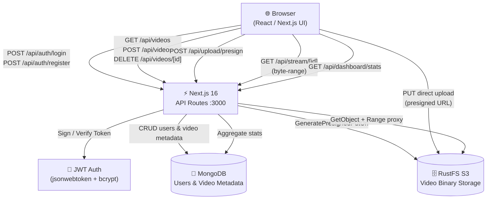
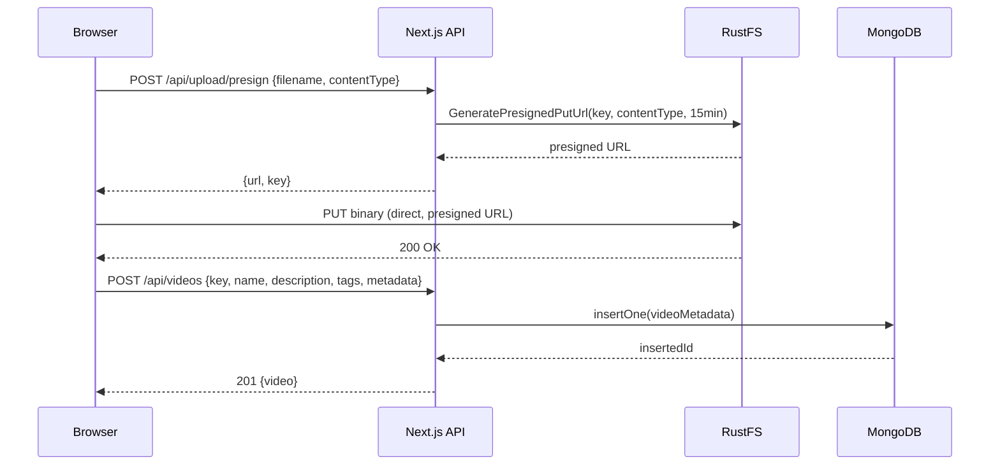

# VideoVault — Video Upload & Management Platform

[](https://github.com/Jorgeaapaz/MISEIA_1-4-90-upload-videos/actions/workflows/ci-cd.yml)


A **Next.js 16 full-stack web application** that lets authenticated users upload, manage, search, and stream videos stored in an S3-compatible object store (RustFS), with metadata persisted in MongoDB.

---

## Architecture

### Component Diagram



### Upload Flow (Sequence)



---

## Features Implemented

### 1. Authentication (Register / Login / JWT)
Users register with email and password (bcrypt-hashed). On login, a signed JWT is returned and stored client-side. Every protected API route validates the token server-side. Each user can only see and manage their own videos.

### 2. Video Upload (Client-Side Direct to RustFS)
The upload flow uses **presigned URLs**: the browser requests a temporary signed S3 URL from the API, then uploads the video file directly to RustFS — keeping the Next.js server out of the data path. The `videos` bucket is auto-created if it does not exist.

### 3. Metadata Management
After upload, users fill a metadata form including: video name, description, tags (multi-value), and arbitrary key-value pairs. Metadata is stored in MongoDB and is fully searchable.

### 4. Search
Full-text search across video name, description, tags, and custom key-value metadata. Powered by MongoDB queries on the server.

### 5. Video Streaming
Videos are streamed via an API route (`/api/stream/[id]`) that proxies byte-range requests from RustFS to the HTML5 `<video>` player, supporting seek and partial-content (HTTP 206).

### 6. Dashboard
Displays per-user statistics: total videos uploaded, total storage consumed, and a quick overview grid of recent uploads.

---

## Project Structure

```
upload-videos/
├── app/
│   ├── (auth)/
│   │   ├── login/page.tsx          — Login form UI
│   │   └── register/page.tsx       — Registration form UI
│   ├── (main)/
│   │   ├── layout.tsx              — Protected layout with Navbar
│   │   ├── dashboard/page.tsx      — Dashboard with stats & recent videos
│   │   ├── upload/page.tsx         — Upload + metadata form page
│   │   ├── videos/page.tsx         — Video library with search
│   │   └── videos/[id]/page.tsx    — Video detail & HTML5 player
│   ├── api/
│   │   ├── auth/login/route.ts     — POST /api/auth/login
│   │   ├── auth/register/route.ts  — POST /api/auth/register
│   │   ├── auth/me/route.ts        — GET /api/auth/me (token validation)
│   │   ├── dashboard/stats/route.ts— GET /api/dashboard/stats
│   │   ├── stream/[id]/route.ts    — GET /api/stream/[id] (byte-range proxy)
│   │   ├── upload/presign/route.ts — POST /api/upload/presign (presigned URL)
│   │   ├── videos/route.ts         — GET (list) / POST (create) videos
│   │   └── videos/[id]/route.ts    — GET / DELETE individual video
│   ├── layout.tsx                  — Root layout, AuthProvider
│   ├── page.tsx                    — Landing page
│   └── globals.css                 — Global Tailwind CSS styles
├── components/
│   ├── MetadataForm.tsx            — Key-value metadata editor
│   ├── Navbar.tsx                  — Top navigation bar
│   ├── SearchBar.tsx               — Search input component
│   ├── StatsCard.tsx               — Dashboard stat card
│   ├── TagInput.tsx                — Tag input with add/remove
│   ├── UploadForm.tsx              — File picker + presign + upload
│   ├── VideoCard.tsx               — Video thumbnail card
│   └── VideoPlayer.tsx             — HTML5 video player wrapper
├── context/
│   └── AuthContext.tsx             — React context for JWT auth state
├── lib/
│   ├── auth.ts                     — JWT sign/verify utilities
│   ├── mongodb.ts                  — MongoDB client singleton
│   ├── s3.ts                       — S3 client (RustFS) + bucket init
│   └── types.ts                    — Shared TypeScript types
├── next.config.ts                  — Next.js configuration
├── proxy.ts                        — Local dev proxy helper
└── package.json                    — Dependencies & scripts
```

---

## Design Patterns / Architecture

| Pattern | Where |
|---|---|
| **Repository / Service layer** | `lib/mongodb.ts` and `lib/s3.ts` encapsulate all data-access logic, keeping API routes thin |
| **Presigned URL (delegated upload)** | `app/api/upload/presign/route.ts` — server signs the URL, browser writes directly to object storage |
| **Context + Provider (React)** | `context/AuthContext.tsx` distributes auth state and logout helper to the entire component tree |
| **Route Groups** | Next.js `(auth)` and `(main)` route groups apply different layouts without affecting URL paths |
| **Byte-range proxy** | `app/api/stream/[id]/route.ts` forwards HTTP 206 partial-content responses, enabling native seek in HTML5 |

---

## How It Works

1. **Upload flow** — the client calls `/api/upload/presign` to get a temporary signed URL, uploads the binary directly to RustFS, then POSTs the metadata (name, description, tags, key-values) to `/api/videos`.
2. **Playback flow** — the `<video>` element points to `/api/stream/[id]`, which fetches the object from RustFS with range support and streams it back to the browser.
3. **Search flow** — the videos list page sends a query string to `GET /api/videos?q=...`, which runs a MongoDB regex/tag match and returns filtered results.

```ts
// Presigned upload — client side
const { url, key } = await fetch('/api/upload/presign', {
  method: 'POST',
  headers: { 'Content-Type': 'application/json', Authorization: `Bearer ${token}` },
  body: JSON.stringify({ filename: file.name, contentType: file.type }),
}).then(r => r.json());

await fetch(url, { method: 'PUT', body: file, headers: { 'Content-Type': file.type } });

// Then save metadata
await fetch('/api/videos', {
  method: 'POST',
  headers: { 'Content-Type': 'application/json', Authorization: `Bearer ${token}` },
  body: JSON.stringify({ key, name, description, tags, metadata }),
});
```

---

## Getting Started

### Prerequisites

- **Node.js** 20+
- **MongoDB** running locally on port `27017`
- **RustFS** (or any S3-compatible store) on `http://localhost:10000` with credentials `minioadmin / minioadmin1234`

### Clone

```bash
git clone https://github.com/Jorgeaapaz/MISEIA_1-4-90-upload-videos.git
cd MISEIA_1-4-90-upload-videos
```

### Environment

Copy `.env.example` to `.env.local` and fill in your values:

```bash
cp .env.example .env.local
```

All required variables with their descriptions are documented in `.env.example`. For a local dev setup with default RustFS credentials:

```env
MONGODB_URI=mongodb://localhost:27017
MONGODB_DB=videovault
RUSTFS_ENDPOINT=http://localhost:10000
RUSTFS_ACCESS_KEY=minioadmin
RUSTFS_SECRET_KEY=minioadmin1234
RUSTFS_BUCKET=videos
JWT_SECRET=<generate with: node -e "console.log(require('crypto').randomBytes(32).toString('hex'))">
```

### Install & Run

```bash
npm install
npm run dev
```

Open [http://localhost:3000](http://localhost:3000).

### Run Tests

```bash
npm test              # Run all tests
npm run test:coverage # Run tests with coverage report
```

Open [http://localhost:3000](http://localhost:3000).

### Build for Production

```bash
npm run build
npm start
```

---

## AI Usage

This project was developed with AI assistance. See [docs/AI_USAGE.md](docs/AI_USAGE.md) for a detailed breakdown of which modules were AI-assisted and the specific changes made to each generated draft.

---

## Technical Decisions

See [docs/DECISIONS.md](docs/DECISIONS.md) for detailed architectural decisions and trade-offs including:
- Presigned URLs vs. server-side upload
- JWT stateless auth vs. session store
- MongoDB vs. PostgreSQL for flexible metadata
- Byte-range proxy vs. direct presigned GET URLs

Formal Architecture Decision Records (ADRs) are in [docs/adr/](docs/adr/).

Quantitative benchmarks justifying key decisions: [docs/BENCHMARKS.md](docs/BENCHMARKS.md).

---

## Deploy to Production

The application is containerized and deploys to a GCP VM behind Traefik with automatic HTTPS.

**Live:** https://videovault.deviaaps.com

### Prerequisites
- Docker and docker-compose on the target VM
- Traefik running in the VM with `miseia-net` Docker network
- SSH access to `gcvmuser@34.174.56.186`

### Manual Deploy

```bash
# 1. SSH into the VM
ssh -i ~/.ssh/vboxuser gcvmuser@34.174.56.186

# 2. Clone / update the project
git clone https://github.com/Jorgeaapaz/MISEIA_1-4-90-upload-videos.git MISEIA190_upload-videos
cd MISEIA190_upload-videos

# 3. Create .env.prod with production values (NEVER commit this file)
cat > .env.prod << 'EOF'
MONGODB_URI=mongodb://admin:<password>@34.174.56.186:27020/?authSource=admin
MONGODB_DB=videovault
RUSTFS_ENDPOINT=http://rustfs:9000
RUSTFS_ACCESS_KEY=<access-key>
RUSTFS_SECRET_KEY=<secret-key>
RUSTFS_BUCKET=videos
JWT_SECRET=<generate: node -e "console.log(require('crypto').randomBytes(32).toString('hex'))">
NODE_ENV=production
EOF

# 4. Build and start
docker compose -f docker-compose.prod.yml up -d --build
```

### Automated Deploy Script

```bash
# From your local machine (set SSH_KEY to your key path)
SSH_KEY=~/.ssh/vboxuser ./deploy.sh
```

---

## Example Flows

### Success — Register & Upload

```
POST /api/auth/register   { email: "alice@example.com", password: "secret" }
→ 201 { message: "User created" }

POST /api/auth/login      { email: "alice@example.com", password: "secret" }
→ 200 { token: "eyJhbGci..." }

POST /api/upload/presign  Authorization: Bearer <token>
                          { filename: "demo.mp4", contentType: "video/mp4" }
→ 200 { url: "http://localhost:10000/videos/...", key: "uuid/demo.mp4" }

PUT  <presigned-url>      (binary video body)
→ 200 OK  (RustFS direct write)

POST /api/videos          { key, name: "Demo", description: "...", tags: ["tutorial"] }
→ 201 { _id: "...", name: "Demo", ... }
```

### Edge Case — Search with No Results

```
GET /api/videos?q=nonexistent
→ 200 { videos: [] }
```

### Edge Case — Unauthorized Access

```
GET /api/videos           (no Authorization header)
→ 401 { error: "Unauthorized" }
```

---

## Tech Stack

| Layer | Technology |
|---|---|
| Frontend | Next.js 16, React 19, Tailwind CSS 4 |
| Backend | Next.js API Routes (Node.js) |
| Object Storage | RustFS (S3-compatible via `@aws-sdk/client-s3`) |
| Database | MongoDB 7 (native driver) |
| Auth | JWT (`jsonwebtoken`) + bcrypt (`bcryptjs`) |
| Language | TypeScript 5 |

---

## Updates — 2026-06-26

### New files added

| File / Directory | Description |
|---|---|
| `__tests__/` | Jest unit & integration test suite (API routes, auth, stream, upload) |
| `jest.config.ts` | Jest configuration with Next.js transform and path aliases |
| `jest.setup.ts` | Jest global setup (fetch polyfill, env vars) |
| `tsconfig.test.json` | TypeScript config extending base for test files |
| `Dockerfile` | Multi-stage production Docker image |
| `.dockerignore` | Docker build context exclusions |
| `docker-compose.prod.yml` | Production compose file (app + RustFS + MongoDB via Traefik) |
| `deploy.sh` | One-command SSH deploy script to GCP VM |
| `scripts/` | Utility scripts (seed data, bucket init, health checks) |
| `.env.example` | Documented template for all required environment variables |
| `.github/workflows/` | GitHub Actions CI/CD pipeline (lint, test, build, deploy) |
| `.gitlab-ci.yml` | GitLab CI mirror pipeline |

### Bug fixes

- **RustFS 8 MB streaming boundary fix** (`app/api/stream/[id]/route.ts`): RustFS returns a 206 with 0 bytes for any range request starting at or beyond the 8 MB boundary. The stream route now caches the full object in-memory and serves byte slices directly for files ≤ 50 MB, bypassing the RustFS range bug transparently.
- **`next.config.ts`**: updated allowed image/video hosts; adjusted headers for range-request passthrough.
- **`package.json` / `package-lock.json`**: added `jest`, `@types/jest`, `jest-environment-node`, `ts-jest`, and `@aws-sdk/s3-request-presigner` dev dependencies.
