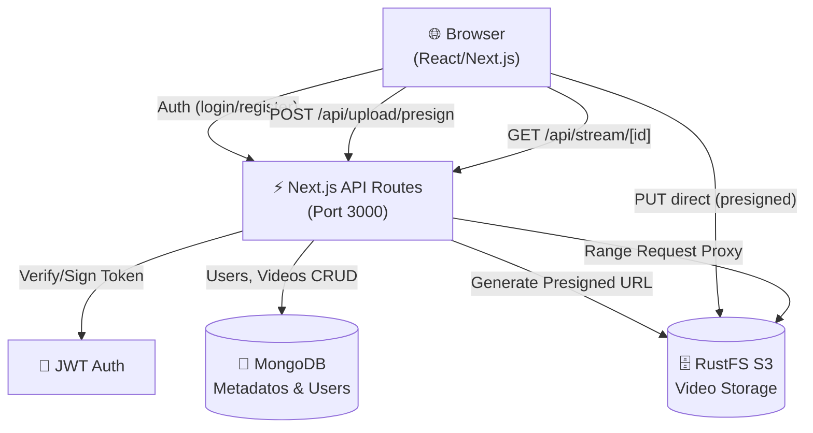

@~/.claude/prompts/new_functionality_prompt_spec.md

# [007] Agregar Diagrama de Arquitectura Mermaid al README

## Role
Act as a Software Architect and Technical Writer expert in system design diagrams and Mermaid syntax.

## Context
**Proyecto:** VideoVault — Next.js 16, MongoDB, RustFS, JWT Auth  
**Repositorio:** `d:\Master-IA-Dev\04-Bloque4\1-4-90-upload-videos\upload-videos`  
**Issue:** `dc_diagrama_arquitectura`  

El README actual tiene una tabla de patrones de diseño pero **no tiene un diagrama visual** de la arquitectura. Los componentes del sistema son:
- **Cliente (Browser)**: React/Next.js con HTML5 video player
- **Next.js Server**: API Routes (auth, videos, presign, stream, dashboard)
- **MongoDB**: Almacén de metadatos de videos y usuarios
- **RustFS (S3-compatible)**: Almacén de archivos de video
- **JWT**: Mecanismo de autenticación

**Flujos principales:**
1. Registro/Login → JWT
2. Upload: Browser → Presign API → RustFS (directo)
3. Metadata: Browser → POST /api/videos → MongoDB
4. Playback: Browser → /api/stream → RustFS (byte-range proxy)
5. Dashboard: Browser → /api/dashboard/stats → MongoDB

## Task
1. Crear un diagrama de arquitectura en formato **Mermaid** que muestre:
   - Los componentes del sistema y sus relaciones
   - Los flujos de datos principales (upload, playback, auth)
2. Insertar el diagrama en el README.md en una nueva sección "Architecture".
3. Opcionalmente, agregar un segundo diagrama de secuencia para el flujo de upload.

### [007] Guidelines
- Usar bloques de código Mermaid: ` ```mermaid `
- El diagrama principal debe ser de tipo `graph TD` o `flowchart TD`.
- El diagrama de secuencia (opcional) debe usar `sequenceDiagram`.
- Los nodos deben estar etiquetados con nombres del sistema real.
- Incluir la distinción entre conexiones directas (Browser→RustFS) vs proxied (Browser→API→RustFS).
- La sección "Architecture" debe ir DESPUÉS de "Features" y ANTES de "Project Structure".
- Los diagramas deben ser legibles en GitHub Markdown (Mermaid está soportado en GitHub).

## Output format
Archivos a modificar:
```
README.md    ← ACTUALIZAR (nueva sección "Architecture" con diagrama Mermaid)
```

### Estructura del diagrama de arquitectura (referencia)


## Examples and Steps to follow
1. Leer el README.md actual para identificar dónde insertar la sección.
2. Crear el diagrama Mermaid de arquitectura con todos los componentes.
3. Crear el diagrama de secuencia para el flujo de upload.
4. Insertar ambos diagramas en la sección "Architecture" del README.
5. Verificar que el Mermaid es válido (sin errores de sintaxis).

## Output checklist and Guardrails
- [ ] Sección "Architecture" visible en el README
- [ ] Diagrama de arquitectura muestra todos los componentes: Browser, Next.js, MongoDB, RustFS
- [ ] Se distingue el upload directo (Browser→RustFS) del proxy de streaming (API→RustFS)
- [ ] El Mermaid es sintácticamente válido (renderiza en GitHub)
- [ ] La sección no elimina ni altera el contenido existente del README
- [ ] Los flujos de datos están etiquetados con los endpoints reales
